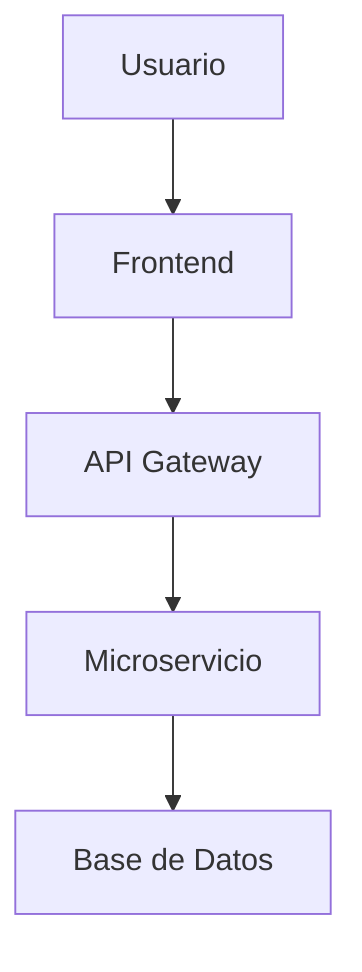

# Análisis Técnico - implementar-dashboard-analytics

**Fecha**: 2025-08-06 16:41:26  
**Analista**: TBD  

## 📋 Historia de Usuario

Como administrador del sistema, quiero un dashboard con métricas de uso y analytics para monitorear el rendimiento y la utilización de la plataforma TEC.Sandbox

## 🏗️ Análisis de Arquitectura

### Componentes Afectados

#### Frontend (Angular)
- [ ] **Componentes UI**: 
  - TBD (basado en ui-patterns.md)
  
- [ ] **Servicios**:
  - TBD (basado en architecture.md)
  
- [ ] **Rutas**:
  - TBD (revisar app.routes.ts)

#### Backend (Microservicios)
- [ ] **APIs afectadas**:
  - TBD (revisar integrations.md)
  
- [ ] **Modelos de datos**:
  - TBD (basado en domain.md)

### 🔄 Flujo de Datos

*Nota: Actualizar diagrama según la funcionalidad específica*

### 🛠️ Cambios Técnicos Requeridos

#### Base de Datos
- [ ] **Nuevas tablas**: TBD
- [ ] **Modificaciones**: TBD
- [ ] **Índices**: TBD

#### APIs
- [ ] **Nuevos endpoints**: TBD
- [ ] **Modificaciones**: TBD
- [ ] **Versioning**: TBD

#### Frontend
- [ ] **Nuevos componentes**: TBD
- [ ] **Modificaciones**: TBD
- [ ] **Estados/Store**: TBD

### 🎨 Consideraciones de UI/UX

Basado en los patrones establecidos en ui-patterns.md:

- [ ] **Componentes del Design System**: TBD
- [ ] **Responsive Design**: Verificar breakpoints
- [ ] **Accessibility**: Cumplir estándares A11y
- [ ] **Loading States**: Implementar skeletons
- [ ] **Error Handling**: Mensajes de error consistentes

### 🔐 Seguridad y Permisos

Basado en USER-ROLES.md:

- [ ] **Roles afectados**: TBD
- [ ] **Permisos requeridos**: TBD
- [ ] **Guards necesarios**: TBD
- [ ] **Validaciones**: TBD

### 📝 Patrones de Código

Siguiendo conventions.md y standards.md:

- [ ] **Standalone Components**: ✅ Usar siempre
- [ ] **Signal-based State**: ✅ Para estado reactivo
- [ ] **Service Injection**: ✅ Usar inject()
- [ ] **Clean Architecture**: ✅ 4 capas en backend

### 🧪 Estrategia de Testing

- [ ] **Unit Tests**: Componentes y servicios
- [ ] **Integration Tests**: APIs y flujos
- [ ] **E2E Tests**: Casos de usuario críticos

## 📊 Complejidad Técnica

| Aspecto | Complejidad | Justificación |
|---------|-------------|---------------|
| Frontend | TBD | TBD |
| Backend | TBD | TBD |
| Base de Datos | TBD | TBD |
| Integración | TBD | TBD |

**Complejidad General**: TBD (Baja/Media/Alta)

## 🚧 Consideraciones de Implementación

### Fase 1: Backend
1. TBD

### Fase 2: Frontend  
1. TBD

### Fase 3: Testing e Integración
1. TBD

---
*Generado automáticamente por refine-hu.sh*
